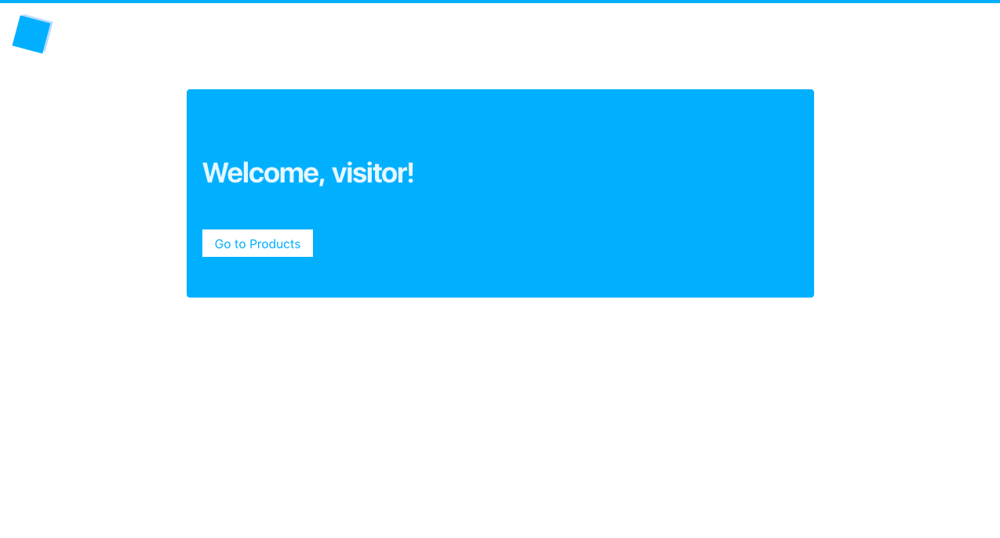
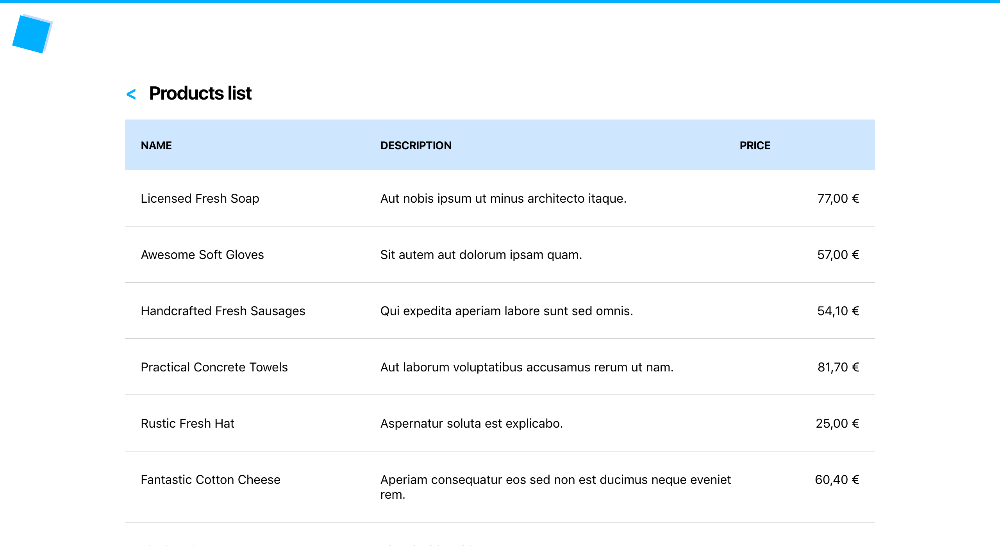
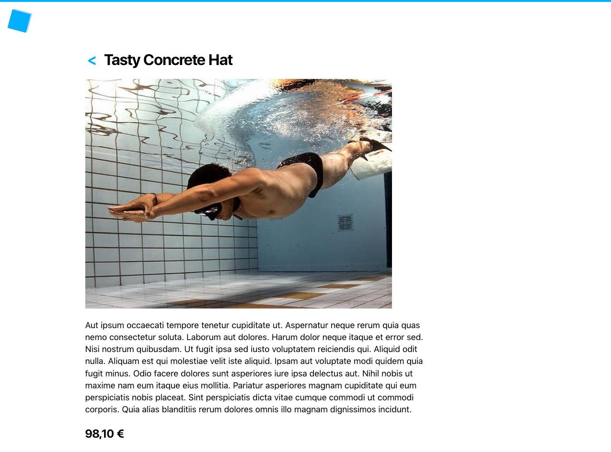
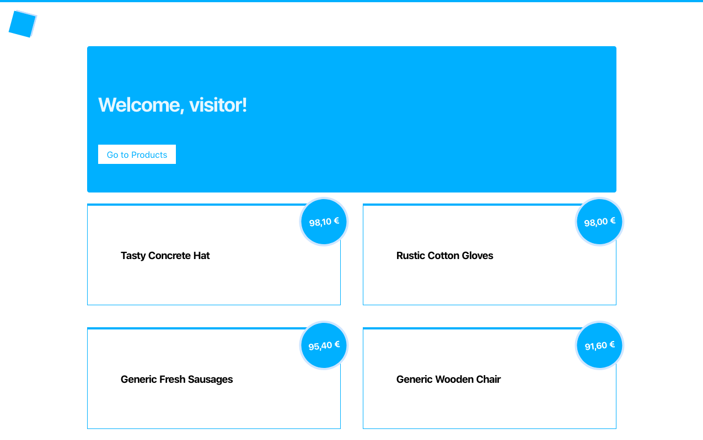

# Products list: params

Create two pages: home (`/`) and products (`/products`).

The home page should only display a greeting: `Welcome, visitor!` and a link to the products page.

The products page should display a list of products. Find the list of products in the `data` folder. 

There is a back button next to the page title that brings the user back to the home page.

1. Details page

Next, let's create a details page for each product. On click on product item in the list, a details page is displayed.
The details page contains the title, the long description, the product image and the price (correctly formatted).
Back button should return to the previous page, which will be the product page (for now).

2. Top 4 products

On the home page display the 4 products with the highest price. On click on the products, the user should go to the details page of this product.

If the user has come from the home page from a top product to the product details page and hits the back button next to the product title, the user should go back to the home page.

If the user came from the products list page to the product details page, they should go back to the products list.

3. Next / prev navigation

Add next product and previous product links at the bottom of the product details page.

If this is the last product, no next button should be displayed. If this is the first product, no prev button should be displayed.

On click on the back button, after pressing either prev or next buttons, the user should go to the page they came from first.

## Final version:

